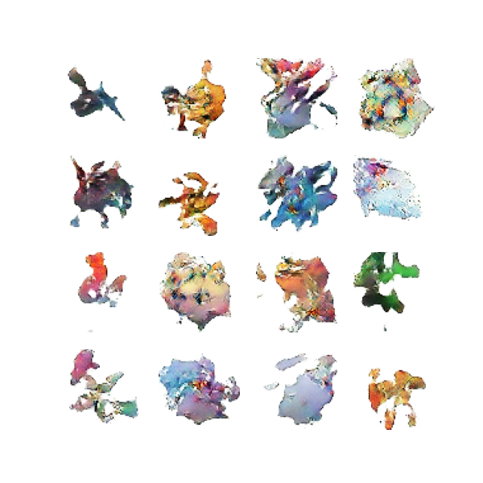
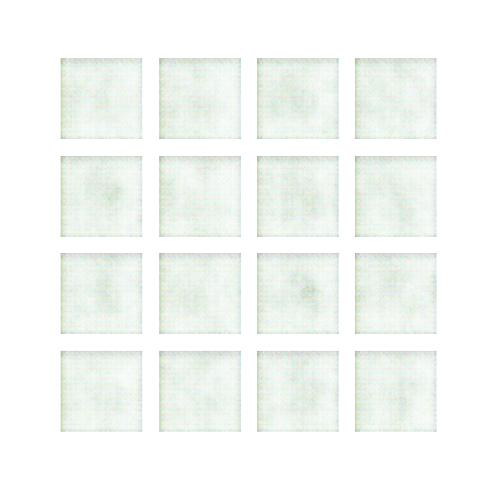
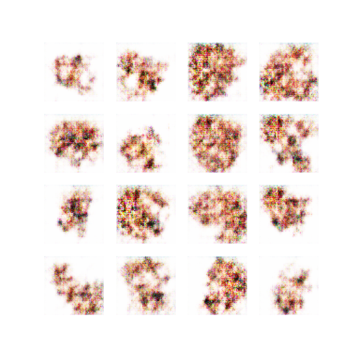
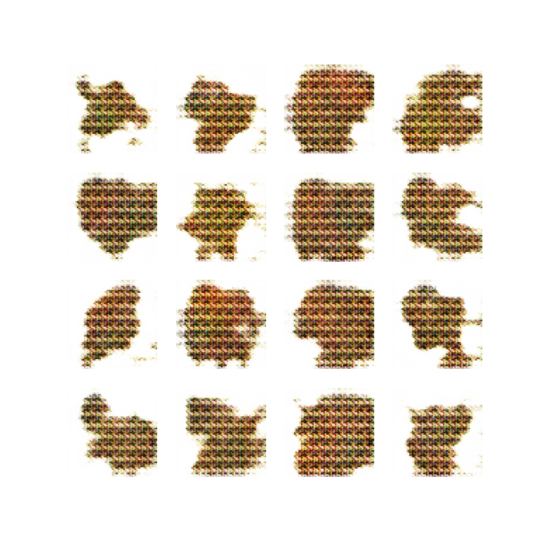
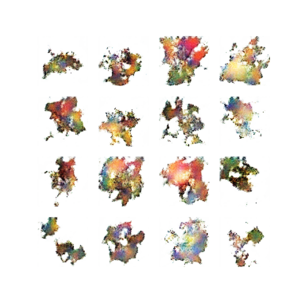
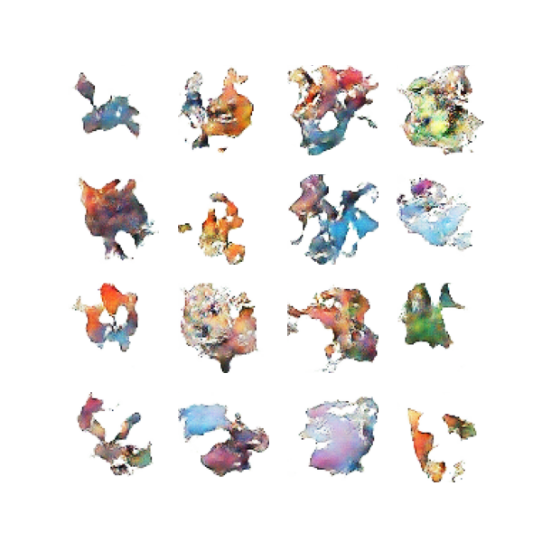

# PokeGAN

Una DCGAN entrenada desde cero durante 10.000 épocas para generar sprites de
Pokémon de 64x64 que no existen. Empezó como proyecto final de una asignatura
de deep learning y acabó siendo sobre todo un ejercicio de pelearse con la
inestabilidad de las GAN, que es donde de verdad se aprende.



## Cómo funciona

Una GAN son dos redes jugando a un juego de suma cero:

- **El generador** parte de un vector de ruido de 100 dimensiones y, a base de
  convoluciones traspuestas (`Conv2DTranspose`), lo proyecta hasta una imagen de
  64x64x3.
- **El discriminador** es un clasificador binario que intenta separar los
  Pokémon reales del dataset de las falsificaciones del generador.

En cada paso el discriminador se entrena para acertar y el generador para
hacerle fallar. El equilibrio entre los dos es todo el problema.

**Dataset:** unas 800 imágenes del [Pokemon Images Dataset](https://www.kaggle.com/datasets/kvpratama/pokemon-images-dataset)
de Kaggle, redimensionadas a 64x64 y normalizadas al rango [-1, 1].

## Lo que se rompió por el camino

Esta es la parte interesante del proyecto. Las tres cosas que costaron:

### Mode collapse

En las primeras versiones el generador encontraba una mancha verdosa y rojiza
que engañaba al discriminador, y a partir de ahí dejaba de explorar: producía la
misma imagen una y otra vez. El modelo había encontrado un mínimo cómodo y se
quedaba ahí.

Se arregló dando ventaja al generador. Bajé el *learning rate* del
discriminador a 2e-5 frente al 1e-4 del generador, que es la idea del **TTUR**
(Two Time-Scale Update Rule), y subí el `Dropout` del discriminador a 0.3. Con
el discriminador aprendiendo más despacio, el generador tiene margen para
probar formas antes de que lo penalicen.

### Artefactos de rejilla

Aparecían patrones de cuadrícula en las imágenes, el problema clásico de
`Conv2DTranspose` cuando el tamaño del filtro no es múltiplo del stride y el
solapamiento queda desigual. Se corrigió ajustando filtros y pasos, y alargando
el entrenamiento para que `BatchNormalization` estabilizara las activaciones.

### Estabilidad a 10.000 épocas

Con etiquetas binarias perfectas (0 y 1) el gradiente se vuelve demasiado
abrupto y el entrenamiento se desmadra a las pocas miles de iteraciones. Con
**label smoothing** las imágenes reales se etiquetan como 0.9 en vez de 1.0, y
eso basta para que el entrenamiento aguante las 10.000 épocas enteras.

## Evolución del entrenamiento

| Época 20 | Época 100 | Época 500 |
| :---: | :---: | :---: |
|  |  |  |

| Época 1000 | Época 3000 | Época 5000 |
| :---: | :---: | :---: |
|  |  |  |

En `Epochs/` están todos los puntos guardados, y en
[`video/evolucion_pokemon.mp4`](video/evolucion_pokemon.mp4) está la evolución
completa montada en vídeo.

## Generar imágenes

El modelo ya entrenado está en `modelo/`. Para sacar una rejilla de muestras:

```bash
pip install -r requirements.txt
python generar.py --n 16 --salida muestras.png
```

O desde Python, si lo prefieres suelto:

```python
import tensorflow as tf

generador = tf.keras.models.load_model(
    "modelo/generador_pokemon_10000_final.h5", compile=False
)
ruido = tf.random.normal([1, 100])
imagen = (generador(ruido, training=False)[0] + 1) / 2   # de [-1,1] a [0,1]
```

El `compile=False` evita que Keras intente reconstruir el optimizador, que para
generar no hace falta. El fichero está en el formato `.h5` antiguo de Keras.

## Reentrenar

El entrenamiento completo está en `entrenamiento_dcgan.ipynb`. Necesitas bajarte el dataset de
Kaggle y dejarlo en la ruta que apunta `DATA_PATH`. Son 10.000 épocas: en una
GPU decente es cuestión de horas, en CPU no lo intentes.

## Arquitectura

| | Generador | Discriminador |
| --- | --- | --- |
| Entrada | ruido de 100 dim | imagen 64x64x3 |
| Bloques | Dense 8x8x256, 3x `Conv2DTranspose` (128, 64, 3) | 2x `Conv2D` (64, 128) |
| Activación | ReLU, `tanh` a la salida | LeakyReLU(0.2) |
| Regularización | BatchNormalization | Dropout(0.3) |
| Optimizador | Adam, lr 1e-4, beta_1 0.5 | Adam, lr 2e-5, beta_1 0.5 |

Pérdida: entropía cruzada binaria desde logits, con label smoothing de 0.9 en
las muestras reales.

## Qué salió y qué no

Lo que funciona: el modelo sale del mode collapse y genera variedad, y captura
bien las paletas de color y las siluetas orgánicas de la franquicia. A 64x64 y
de reojo, muchas muestras pasan por Pokémon.

Lo que no: a esa resolución no hay detalle real, y ninguna criatura tiene
anatomía coherente si te paras a mirarla. Subir a 128x128 pedía más profundidad
de filtros y bastante más entrenamiento del que tenía tiempo de hacer. Tampoco
medí nada de forma objetiva: no hay FID ni Inception Score, la evaluación fue
mirar las rejillas de muestras, que para un trabajo de clase vale pero no es
evaluar.

## Estructura

```
entrenamiento_dcgan.ipynb   el entrenamiento completo, celda a celda
generar.py                  genera muestras desde el modelo entrenado
modelo/                     generador entrenado, 10.000 épocas
Epochs/                     muestras guardadas durante el entrenamiento
video/                      la evolución montada en vídeo
```

## Referencias

- Ian J. Goodfellow et al. (2014), [*Generative Adversarial Nets*](https://arxiv.org/abs/1406.2661).
- Alec Radford et al. (2015), [*Unsupervised Representation Learning with Deep
  Convolutional Generative Adversarial Networks*](https://arxiv.org/abs/1511.06434),
  el paper de la DCGAN.
- Heusel et al. (2017), [*GANs Trained by a Two Time-Scale Update Rule*](https://arxiv.org/abs/1706.08500),
  de donde sale el TTUR.
- El [tutorial de DCGAN de TensorFlow](https://www.tensorflow.org/tutorials/generative/dcgan),
  que fue el punto de partida.
- Dataset: [Pokemon Images Dataset](https://www.kaggle.com/datasets/kvpratama/pokemon-images-dataset), de Kaggle.

## Licencia

El código está bajo licencia MIT, con copyright de jorgeress. Ver
[LICENSE](LICENSE).

Eso cubre el código y nada más. El modelo entrenado (`modelo/`) y las imágenes
generadas (`Epochs/`, `video/`) salen de un dataset de ilustraciones de Pokémon,
que son propiedad de Nintendo, Game Freak y Creatures. Los publico como
resultado de un trabajo académico, no como algo que puedas reutilizar
libremente. Si vas a hacer cualquier cosa con ellos que no sea mirarlos,
infórmate tú.
